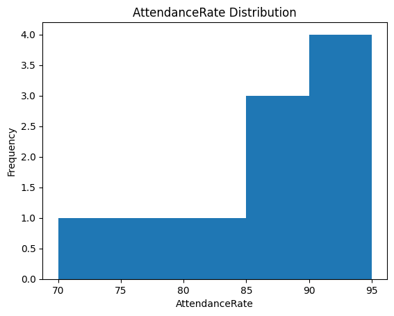

# Student Performance Analysis and Descriptive Statistics with **Polars**

## Project Overview

This project is designed to analyze student performance using the dataset `student_performance.csv` with the **Polars** DataFrame library. Polars is known for its performance, especially on large datasets, providing a fast and efficient way to handle data compared to traditional tools like Pandas. The goal is to implement a Python script that calculates statistical metrics (mean, median, and standard deviation) for various numeric columns in the dataset using Polars, along with visual insights through histograms for specified columns.

This project follows best practices for code quality and testing, leveraging Python tools like `Pylint` for linting, `pytest` for testing, and `matplotlib` for visualization. Polars enables quicker computations, making this project more scalable and efficient.

## What is Polars?

**Polars** is a high-performance DataFrame library for Rust and Python. It is designed to be **blazingly fast** and **memory-efficient**, making it a popular choice for large-scale data processing and analysis tasks. Unlike Pandas, which operates on row-major order (like Python’s native lists), Polars is designed with columnar data structures in mind, making it highly performant for operations such as filtering, aggregating, and statistical calculations on large datasets.

Polars offers several key advantages:
- **Speed**: Significantly faster than Pandas for large datasets.
- **Memory Efficiency**: Uses less memory compared to other DataFrame libraries.
- **Parallelization**: Built-in parallelization for faster computations on multi-core machines.

## Files Overview

- **`hello.py`**: Contains the main logic for calculating the mean, median, and standard deviation of a specified column using Polars. It also includes functionality to draw histograms for data visualization.
- **`test_hello.py`**: Includes test cases for the functions in `hello.py`. The tests validate the correctness of the statistical calculations and check for proper handling of non-numeric columns.
- **`student_performance.csv`**: The dataset used for analysis, containing student performance data with various attributes.
- **`Makefile`**: Automates the process of installation, linting, formatting, and testing the codebase.
- **`requirements.txt`**: Specifies the Python dependencies required for this project, including `polars`, `pytest`, `pylint`, and `matplotlib`.

## Functionality

The primary functionality of this project is to compute descriptive statistics for numerical columns in the dataset using **Polars** and to visualize the distribution of these columns using histograms.

### Key Functions in `hello.py`:

1. **`calc_mean(df, colname)`**: Calculates the mean of the specified column using Polars. Returns a message if the column is not numeric or doesn't exist.
2. **`calc_median(df, colname)`**: Computes the median of the specified column using Polars.
3. **`calc_sd(df, colname)`**: Computes the standard deviation for the given column using Polars.
4. **`draw(df, colname)`**: Generates a histogram for the specified column using `matplotlib`. The Polars column is converted to a NumPy array for plotting.

### Example

Here is an example of the `draw()` function plotting the histogram for the Attendance Rate column:

### Why Use Polars?

Using **Polars** instead of Pandas for this project enables faster computations and more memory-efficient data processing, especially useful when working with large datasets. Polars' modern design and parallelized execution offer significant performance improvements, making it a suitable choice for complex data analysis tasks.

### Testing

Testing is an essential part of this project. The test suite in `test_hello.py` ensures that:

- Mean, median, and standard deviation calculations are correct for numerical columns.
- Non-numeric columns are handled appropriately with informative messages.
- Histograms are generated without errors.
